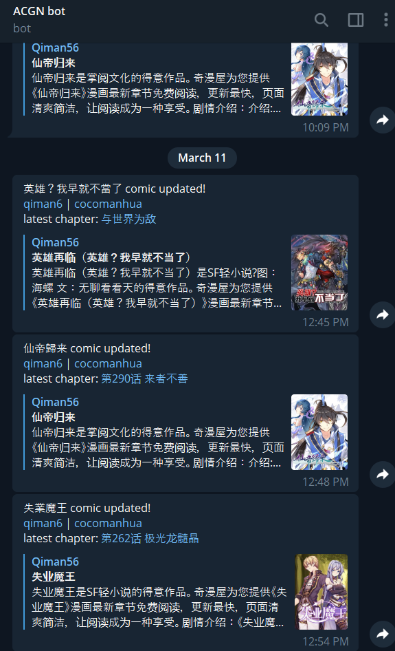

# Telegram bot: Check anime/comic/game/novel websites update

## Introduction

This bot scans anime/comic/game/novel websites, and send telegram message to specific channel/group/chat upon new chapters releases.

### Screenshots




### Default Settings

Checking interval: ***5~30 per min***

RETRY_INTERVAL: 5min

MAX_RETRY_NUM: 5

Current supported websites:

- novel: <http://www.wutuxs.com>
- comic: <https://www.cocomanhua.com>
- comic: <https://m.manhuagui.com/>
- novel: <https://www.esjzone.cc/> (Only works for in-site links)
- novel: <https://ncode.syosetu.com>

## How to use

### Setup

Choose either option below to run the application

#### Option 1: Python

1. Create `.env`

    ```sh
    TOKEN=<your token>
    CHAT_ID=<your chat_id>
    ```

2. Start the application with the following command:

    ```sh
    pip install -r requirements.txt
    python main.py
    ```

#### Option 2: Docker Compose

1. Create `.env`

    ```sh
    TOKEN=<your token>
    CHAT_ID=<your chat_id>
    ```

2. Start the container with the following command:

    ```sh
    docker-compose up -d
    ```

#### Option 3: Kubernetes

1. Set your bot token and chat_id in `secret/acgn-bot`

    ```sh
    # Examples in k8s/secrets/k8s-secrets.yaml, remember to change to your token/chat_id first
    kubectl apply -f k8s/secrets/k8s-secrets.yaml
    ```

2. Set your checking list yaml file in `configmap/acgn-bot.list.yaml`

    ```sh
    kubectl create configmap acgn-bot.list.yaml --from-file=config/list.yaml --dry-run=client -o yaml | kubectl apply -f -
    ```

3. Build local image and create deployment

    ```sh
    docker build . -t nonjosh/acgn-bot
    kubectl apply -k k8s/base
    ```

### Edit your list

Edit your list in the file `list.yaml`. Restart container to apply changes.

## Features to add

- [ ] Show error for invalid pages (e.g. esjzone)
- [ ] hack cocomanhua cloudflare DDOS protection
- [ ] add support for mangatoro.com
- [X] ConfigMap for setting
- [X] Revamp main.py (add more re-usable functions/classes)
- [ ] Support other IM bot other than Telegram (e.g. Signal, Discord)
- [ ] Add back time range for checking
